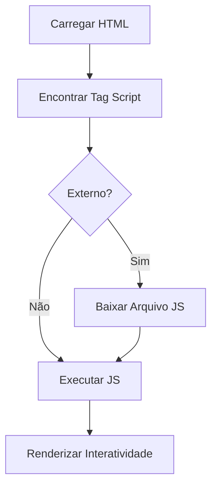

# Aula 01 - Introdução ao JavaScript 😊

!!! tip "Objetivo"
    **Objetivo**: Compreender o que é o JavaScript, sua importância no desenvolvimento web moderno, como incluí-lo em páginas HTML e como utilizar o console do navegador para depuração básica.

---

## 1. O que é JavaScript? 🧩

O **JavaScript (JS)** é uma linguagem de programação de alto nível, interpretada e que segue o padrão ECMAScript. É um dos pilares da tríade da web, junto com HTML e CSS.

> [!NOTE]
> Enquanto o HTML define a **estrutura** e o CSS define o **estilo**, o JavaScript é responsável pelo **comportamento** (interatividade).

### 🚀 Por que JavaScript?
- **Universal**: Roda em todos os navegadores modernos sem necessidade de plugins.
- **Versátil**: Pode ser usado no Frontend (navegador), Backend (Node.js), Mobile (React Native) e até em IoT.
- **Assíncrono**: Gerencia múltiplas tarefas ao mesmo tempo sem travar a interface.

---

## 2. Inserção no HTML 🏗️

Existem três formas principais de incluir JavaScript em uma página web:

### A. Interno (Tag script)
Colocado diretamente no HTML, geralmente antes do fechamento da tag `</body>`.

```html
<script>
  console.log("Olá do script interno!");
</script>
```

### B. Externo (Arquivo .js)
A forma mais recomendada para organização de código.

```html
<script src="script.js"></script>
```

### C. Inline (Atributos)
Inserido diretamente em elementos HTML (evite usar em projetos reais).

```html
<button onclick="alert('Oi!')">Clique aqui</button>
```

---

## 3. Fluxo de Execução 📊

O diagrama abaixo ilustra como o navegador processa o JavaScript:



---

## 4. Console do Navegador 💻

O Console é a ferramenta indispensável para todo desenvolvedor JavaScript. Ele permite visualizar logs, erros e testar códigos rapidamente.

### Comandos Básicos (Exemplo no Termynal)

```termynal
$ // Abra o DevTools (F12) e digite:
$ console.log("Bem-vindo ao curso!");
> "Bem-vindo ao curso!"
$ console.error("Isso é um aviso de erro.");
> ❌ Isso é um aviso de erro.
$ console.warn("Isso é um alerta importante.");
> ⚠️ Isso é um alerta importante.
```

> [!CAUTION]
> Nunca copie e cole códigos desconhecidos no console do seu navegador, pois isso pode comprometer sua segurança.

---

## 5. Mini Projeto: Meu Primeiro Script 🏆

Neste mini-projeto, você criará uma saudação dinâmica que aparece no console.

**Passos:**
1. Crie um arquivo `index.html`.
2. Adicione a estrutura básica do HTML5.
3. Antes do `</body>`, insira uma tag `<script>`.
4. Use o comando `console.log` para imprimir seu nome e uma mensagem de boas-vindas.

```javascript
// Exemplo de código
const nome = "Dev";
console.log("Olá, " + nome + "! Você está pronto para programar?");
```

---

## 6. Exercícios de Fixação 📝

### Básicos
1. Qual o comando utilizado para exibir uma mensagem no console do navegador?
2. Qual a principal diferença entre incluir o JavaScript no `<head>` versus no final do `<body>`?

### Intermediários
3. Crie um arquivo HTML que utilize um script externo chamado `app.js` e exiba um `alert` ao carregar.
4. Explique por que o JavaScript é considerado uma linguagem de "comportamento" na web.

### Desafio
5. Utilize o console para realizar uma conta matemática simples (ex: 15 * 3) e exiba o resultado precedido da frase "O resultado é: ".

---

**Próxima Aula**: Vamos aprender sobre [Variáveis e Tipos](./aula-02.md)! 📈
