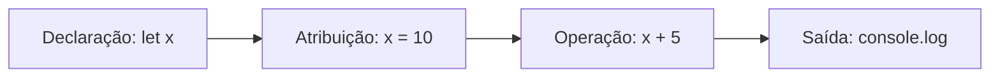

# Aula 02 - Variáveis e Tipos 📊

!!! tip "Objetivo"
    **Objetivo**: Compreender como armazenar dados na memória utilizando `let` e `const`, conhecer os tipos primitivos do JavaScript e dominar os operadores básicos para manipulação desses dados.

---

## 1. Declarando Variáveis: let vs const 📦

No JavaScript moderno (ES6+), utilizamos duas palavras-chave principais para criar variáveis. O antigo `var` deve ser evitado devido a problemas de escopo.

- **`let`**: Permite que o valor da variável seja alterado posteriormente (reatribuição).
- **`const`**: Cria uma "constante", cujo valor não pode ser alterado após a atribuição inicial.

> [!IMPORTANT]
> Use `const` por padrão. Só mude para `let` se você tiver certeza de que o valor precisará ser alterado ao longo do código.

### Exemplo de Uso:

```javascript
const nome = "Ricardo"; // Não muda
let idade = 30;         // Pode mudar no próximo ano

idade = 31; // Correto
// nome = "João"; // Erro! Const não pode ser reatribuída.
```

---

## 2. Tipos Primitivos 🧩

O JavaScript possui tipos básicos que definem a natureza do dado:

- **String**: Textos (delimitados por aspas simples, duplas ou crases).
- **Number**: Números (inteiros ou decimais).
- **Boolean**: Valores lógicos (`true` ou `false`).
- **Undefined**: Indica que a variável foi declarada, mas não tem valor.
- **Null**: Indica a ausência intencional de qualquer valor.

---

## 3. Operadores ⚙️

Os operadores permitem realizar cálculos e comparações.

### A. Aritméticos
```javascript
let soma = 10 + 5;        // 15
let subtracao = 20 - 8;    // 12
let multiplicacao = 4 * 3; // 12
let divisao = 100 / 2;     // 50
let resto = 10 % 3;        // 1 (Resto da divisão)
```

### B. Atribuição
```javascript
let x = 10;
x += 5; // x agora é 15 (Mesmo que x = x + 5)
```

---

## 4. Evolução dos Dados 📊

Veja como os dados fluem durante a execução:



---

## 5. Prática no Console 💻

```termynal
$ // Teste os tipos de dados
$ typeof "Olá";
> "string"
$ typeof 42;
> "number"
$ typeof true;
> "boolean"
$ let a = 10; let b = 20; console.log(a + b);
> 30
```

> [!TIP]
> O operador `typeof` é excelente para descobrir qual o tipo de uma variável em tempo de execução.

---

## 6. Mini Projeto: Calculadora de Idade 🏆

Vamos criar um script que calcula quantos anos falta para alguém completar 100 anos.

**Passos:**
1. Declare uma `const` com o ano atual.
2. Declare uma `let` com o seu ano de nascimento.
3. Calcule a idade atual e armazene em uma variável.
4. Calcule quantos anos faltam para os 100 e exiba a mensagem: "Faltam X anos para você completar um século!".

---

## 7. Exercícios de Fixação 📝

### Básicos
1. Qual a diferença fundamental entre `let` e `const`?
2. Liste os 5 tipos primitivos do JavaScript vistos nesta aula.

### Intermediários
3. Crie um código que armazene seu nome em uma constante e sua cor favorita em uma variável `let`. Depois, altere a cor favorita e exiba uma frase combinando os dois valores.
4. O que acontece se tentarmos somar um número com uma string (ex: `10 + "5"`)? Teste no console e explique o resultado.

### Desafio
5. Crie um script que calcule a média de 3 notas de um aluno e exiba o resultado no console. Use `const` para as notas e mostre o tipo de dado do resultado final usando `typeof`.

---

**Próxima Aula**: Vamos aprender a tomar decisões com [Condições](./aula-03.md)! 🧠
