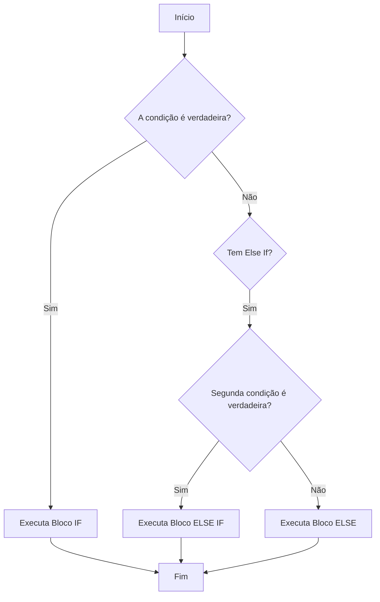

# Aula 03 - Condições 🧠

!!! tip "Objetivo"
    **Objetivo**: Aprender a controlar o fluxo do seu programa utilizando estruturas condicionais, permitindo que o código tome decisões baseadas em diferentes cenários e valores.

---

## 1. O que são Condicionais? 🛣️

Na programação, nem sempre queremos que o código seja executado em linha reta. Muitas vezes, precisamos que ele siga caminhos diferentes dependendo de uma condição ser verdadeira ou falsa.

### Estrutura if / else
É a forma mais comum de tomada de decisão.

```javascript
const idade = 18;

if (idade >= 18) {
  console.log("Você é maior de idade. Acesso permitido.");
} else {
  console.log("Você é menor de idade. Acesso negado.");
}
```

---

## 2. Condições Encadeadas: else if 🪜

Quando temos mais de duas possibilidades, usamos o `else if` para testar novas condições.

```javascript
const nota = 85;

if (nota >= 90) {
    console.log("Desempenho: Excelente! 🌟");
} else if (nota >= 70) {
    console.log("Desempenho: Bom! 👍");
} else {
    console.log("Desempenho: Precisa melhorar. 📚");
}
```

---

## 3. Operadores de Comparação e Lógicos ⚖️

Para criar condições complexas, utilizamos operadores especiais:

### Comparação
- `==`: Igualdade (valor)
- `===`: Igualdade estrita (valor e tipo) - **RECOMENDADO**
- `!=`: Diferente
- `>` / `<`: Maior que / Menor que
- `>=` / `<=`: Maior ou igual / Menor ou igual

### Lógicos
- `&&` (E): Todas as condições devem ser verdadeiras.
- `||` (OU): Pelo menos uma condição deve ser verdadeira.
- `!` (NÃO): Inverte o valor booleano.

---

## 4. Fluxo de Decisão 📊

Veja como o JavaScript decide qual caminho seguir:



---

## 5. Prática Experimental 💻

```termynal
$ // Teste de lógica no terminal
$ let sol = true; let dinheiro = 100;
$ if (sol && dinheiro > 50) { console.log("Partiu praia! 🏖️"); }
> "Partiu praia! 🏖️"
$ console.log(10 === "10");
> false
$ console.log(10 == "10");
> true
```

> [!WARNING]
> Sempre prefira o operador `===` (estrito) para evitar comportamentos inesperados causados pela coerção de tipos automática do JavaScript.

---

## 6. Mini Projeto: Classificador de Triângulos 🏆

Crie um script que receba três lados de um triângulo e diga se ele é:
- **Equilátero**: Todos os lados iguais.
- **Isósceles**: Dois lados iguais.
- **Escaleno**: Todos os lados diferentes.

**Dica**: Use `if`, `else if` e o operador de comparação `===`.

---

## 7. Exercícios de Fixação 📝

### Básicos
1. Escreva um código que verifique se um número é par ou ímpar.
2. O que o seguinte código imprimirá: `if (5 > 10 || 1 == 1) { console.log("A"); } else { console.log("B"); }`?

### Intermediários
3. Crie um sistema de login simples: declare `usuarioCerto` e `senhaCerta`. Use um `if` para verificar se o input do usuário coincide com ambos.
4. Explique a diferença entre `==` e `===` com um exemplo prático que resulte em valores diferentes.

### Desafio
5. Crie um calculador de IMC (Índice de Massa Corporal) que exiba a categoria do usuário:
   - Abaixo de 18.5: Abaixo do peso
   - 18.5 a 24.9: Peso normal
   - 25 ou mais: Acima do peso

---

**Próxima Aula**: Vamos aprender a repetir tarefas com [Laços de Repetição](./aula-04.md)! 🔁
