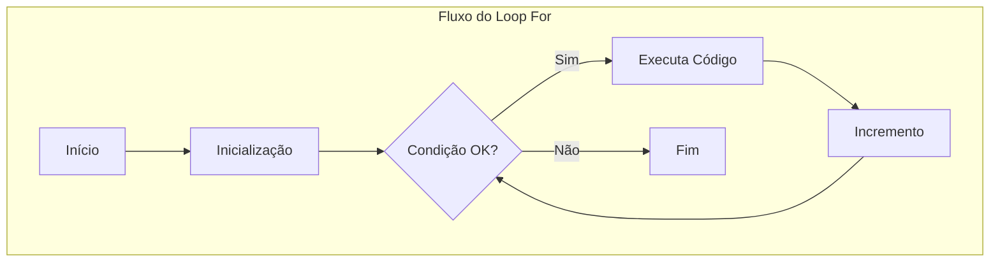

# Aula 04 - Laços de Repetição 🔁

!!! tip "Objetivo"
    **Objetivo**: Compreender como automatizar tarefas repetitivas utilizando estruturas de repetição como `for` e `while`, otimizando o código e evitando a duplicação manual de comandos.

---

## 1. Por que usar Laços (Loops)? 🔁

Imagine que você precisa imprimir no console os números de 1 a 1000. Fazer isso manualmente seria inviável. Os laços permitem executar o mesmo bloco de código várias vezes enquanto uma condição for atendida.

---

## 2. O Laço `for` 🏎️

O `for` é ideal quando sabemos exatamente quantas vezes queremos repetir o código. Ele é dividido em três partes:
1.  **Inicialização**: Onde a variável de controle começa.
2.  **Condição**: Enquanto for verdadeira, o loop continua.
3.  **Incremento**: Como a variável muda a cada volta.

```javascript
// Exemplo: Contar de 1 a 5
for (let i = 1; i <= 5; i++) {
  console.log("Número: " + i);
}
```

---

## 3. O Laço `while` 🕰️

O `while` (enquanto) é usado quando não sabemos exatamente o número de repetições, dependendo apenas de uma condição externa ou variável que mude dentro do loop.

```javascript
let energia = 3;

while (energia > 0) {
    console.log("Ainda tenho energia para correr...");
    energia--; // Importante para não criar um loop infinito!
}
console.log("Cansado. Hora de descansar.");
```

> [!CAUTION]
> **Atenção ao Loop Infinito**: Se a condição do `while` nunca se tornar falsa (ex: esquecer de decrementar a variável), seu navegador travará.

---

## 4. Diferença Visual dos Laços 📊



---

## 5. Prática Experimental no Terminal 💻

```termynal
$ // Tabuada do 5 com laço for
$ for(let i=1; i<=3; i++) { console.log("5 x " + i + " = " + (5*i)); }
> "5 x 1 = 5"
> "5 x 2 = 10"
> "5 x 3 = 15"
$ // Loop While simples
$ let x = 0; while(x < 2) { console.log("x vale: " + x); x++; }
> "x vale: 0"
> "x vale: 1"
```

> [!NOTE]
> No desenvolvimento real, o `for` é muito utilizado para percorrer listas de dados (que veremos em breve).

---

## 6. Mini Projeto: O Contador de Passos 🏆

Crie um script que simule um objetivo de caminhada.
- O objetivo é dar 10 passos.
- Use um laço `while` que imprima no console: "Você deu o passo número X".
- Ao final, imprima: "Parabéns! Você alcançou sua meta diária! 🏃".

---

## 7. Exercícios de Fixação 📝

### Básicos
1. Escreva um laço `for` que conte de 10 até 1 (contagem regressiva).
2. Qual a principal diferença de uso entre o `for` e o `while`?

### Intermediários
3. Crie um script que some todos os números de 1 a 10 usando um laço e exiba apenas o resultado final.
4. Escreva um código que use um `while` para exibir os múltiplos de 3 entre 1 e 20.

### Desafio
5. **O Jogo da Adivinhação (Lógica)**:
   Crie uma variável `numeroSecreto`. Use um laço (que você desejar) para simular tentativas até que o número seja encontrado. Exiba no console quantas tentativas foram necessárias.

---

**Próxima Aula**: Vamos aprender a organizar código com [Funções](./aula-05.md)! 🏗️