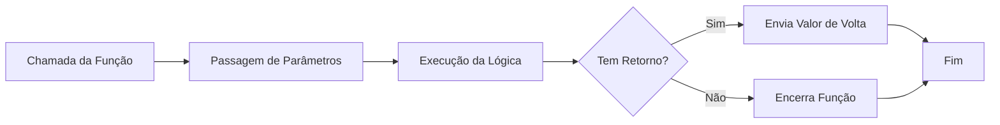

# Aula 05 - Funções 🏗️

!!! tip "Objetivo"
    **Objetivo**: Compreender o conceito de funções como blocos de código reutilizáveis, aprender a passar informações via parâmetros e como retornar resultados para o programa principal.

---

## 1. O que é uma Função? 🧱

Uma **função** é um conjunto de instruções que executa uma tarefa específica. Em vez de repetir o mesmo código em vários lugares, você o "empacota" em uma função e a chama sempre que necessário.

### Analogia do Liquidificador 🥤
Imagine uma função como um liquidificador:
1.  **Entrada (Ingredientes)**: Você coloca as frutas (parâmetros).
2.  **Processamento (Bater)**: O motor gira as lâminas (lógica interna).
3.  **Saída (Suco)**: Você recebe o resultado final (retorno).

---

## 2. Declaração de Funções ✍️

No JavaScript, a forma clássica de criar uma função é usando a palavra `function`.

```javascript
function saudar(nome) {
  return "Olá, " + nome + "! Bem-vindo.";
}

// Chamando a função
const mensagem = saudar("Ricardo");
console.log(mensagem); // "Olá, Ricardo! Bem-vindo."
```

---

## 3. Arrow Functions 🏹

Introduzidas no ES6, as **Arrow Functions** são uma forma mais curta e moderna de escrever funções. Elas são muito comuns em bibliotecas como React e Vue.

```javascript
// Função tradicional
function somar(a, b) {
  return a + b;
}

// Arrow function (mesmo resultado)
const somarArrow = (a, b) => a + b;

console.log(somarArrow(10, 20)); // 30
```

---

## 4. Fluxo de uma Função 📊



---

## 5. Prática Experimental no Terminal 💻

```termynal
$ // Criando uma função anônima
$ const dobro = n => n * 2;
$ dobro(50);
> 100
$ // Função com múltiplos parâmetros
$ const calcularArea = (base, altura) => base * altura;
$ calcularArea(10, 5);
> 50
```

> [!TIP]
> Use nomes de funções que sejam **verbos** (ex: `calcularTotal`, `enviarEmail`, `validarDados`). Isso torna seu código muito mais legível.

---

## 6. Mini Projeto: Conversor de Moedas 🏆

Crie uma função que converta Reais (BRL) para Dólares (USD).
- A função deve receber o `valorEmReal` e a `cotacaoDoDia`.
- Deve retornar o valor convertido.
- Exiba no console o resultado formatado: "R$ 100,00 equivalem a $ [valor] USD".

---

## 7. Exercícios de Fixação 📝

### Básicos
1. Crie uma função chamada `apresentar` que receba um nome e uma idade e imprima uma frase no console.
2. Qual a diferença visual na sintaxe entre uma função tradicional e uma Arrow Function?

### Intermediários
3. Escreva uma função que receba um número e retorne `true` se ele for positivo e `false` se for negativo.
4. Converta a função abaixo para uma Arrow Function:
   ```javascript
   function quadrado(n) {
     return n * n;
   }
   ```

### Desafio
5. **Calculadora Simples**:
   Crie uma função `calculadora` que receba três parâmetros: `num1`, `num2` e `operacao` (uma string como "+", "-", "*", "/").
   - Utilize um `switch` ou `if/else` dentro da função para realizar a conta correta.
   - Retorne o resultado final.

---

**Próxima Aula**: Vamos aprender a agrupar dados complexos com [Objetos e Arrays](./aula-06.md)! 📦
