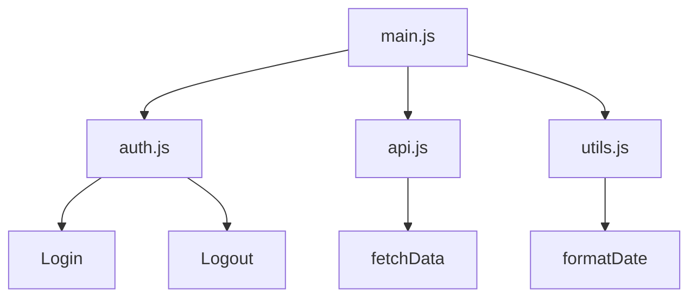

# Aula 07 - Módulos JS 🧩

!!! tip "Objetivo"
    **Objetivo**: Aprender a dividir seu código em múltiplos arquivos utilizando o sistema de módulos (ES6 Modules), facilitando a manutenção, organização e reutilização de scripts.

---

## 1. Por que modularizar? 🏗️

Até agora, escrevemos todo o código em um único arquivo. Conforme o projeto cresce, isso se torna impossível de gerenciar. Modularizar significa:
1.  **Organização**: Cada arquivo tem uma responsabilidade única.
2.  **Reutilização**: Você pode usar a mesma função em diferentes partes do projeto.
3.  **Namespace**: Evita conflitos de nomes de variáveis entre diferentes scripts.

---

## 2. Exportando Código (`export`) 📤

Para que uma função ou variável seja visível fora do seu arquivo original, precisamos explicitamente "exportá-la".

```javascript
// arquivo: matematica.js

export const somar = (a, b) => a + b;
export const subtrair = (a, b) => a - b;

export default function calcular(a, b) {
    return a * b; // Exportação padrão
}
```

---

## 3. Importando Código (`import`) 📥

No arquivo onde você deseja usar as funções, você as "importa".

```javascript
// arquivo: main.js
import { somar, subtrair } from './matematica.js';
import multiplicar from './matematica.js'; // Importando o default

console.log(somar(10, 5)); // 15
console.log(multiplicar(2, 4)); // 8
```

---

## 4. Estrutura Modular 📊



---

## 5. Prática no Terminal 💻

```termynal
$ // Exemplo de estrutura de arquivos
$ ls
> main.js  utils.js  config.js
$ cat config.js
> export const API_URL = "https://api.exemplo.com";
$ // Importando no console (simulação)
$ import { API_URL } from './config.js';
$ console.log(API_URL);
> "https://api.exemplo.com"
```

> [!IMPORTANT]
> Para usar módulos nativos no navegador, você deve incluir o script com o atributo `type="module"` no seu HTML: `<script type="module" src="main.js"></script>`.

---

## 6. Mini Projeto: Calculadora Modular 🏆

Divida sua lógica matemática em dois arquivos:
1.  `operacoes.js`: Exporta funções para somar, subtrair, multiplicar e dividir.
2.  `app.js`: Importa as funções e as utiliza para realizar contas, exibindo o resultado no console.

---

## 7. Exercícios de Fixação 📝

### Básicos
1. Qual o comando usado para tornar uma função disponível para outros arquivos?
2. Como importamos uma função que foi exportada como `export default`?

### Intermediários
3. Qual a diferença entre `export const` e `export default`?
4. Tente importar uma função que não foi exportada. O que acontece com o código?

### Desafio
5. **Organização de Projeto**:
   Imagine que você está criando um jogo.
   - Quais módulos você criaria? (Ex: `inimigo.js`, `player.js`).
   - Liste 3 funções que estariam no módulo `utils.js` (utilitários).
   - Como você faria para o módulo `inimigo.js` ter acesso à posição do `player.js`?

---

**Próxima Aula**: Fim do Módulo 1! No Módulo 2, iniciaremos a [Manipulação do DOM](./aula-08.md)! 🌐