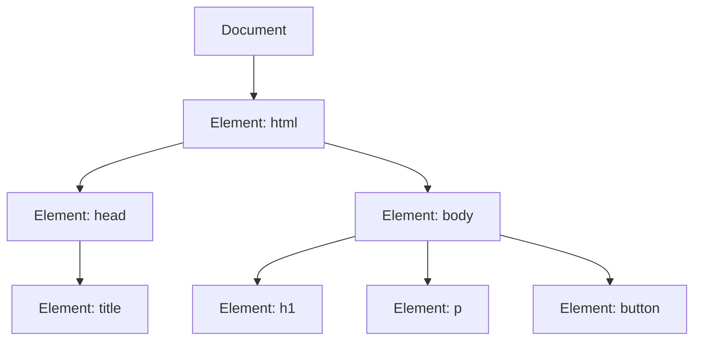

# Aula 08 - Introdução ao DOM 🌐

!!! tip "Objetivo"
    **Objetivo**: Compreender o que é o DOM (Document Object Model) e como o JavaScript o utiliza para acessar e manipular os elementos de uma página HTML de forma dinâmica.

---

## 1. O que é o DOM? 🌳

O DOM (**Document Object Model**) é uma interface que representa o documento HTML como uma estrutura de árvore. Cada tag, atributo ou texto no seu HTML torna-se um "nó" (node) que pode ser manipulado pelo JavaScript.

### A Árvore do DOM 📊



---

## 2. Selecionando Elementos 🎯

Para alterar algo na página, primeiro precisamos "encontrá-lo". O JavaScript oferece vários métodos para isso:

### Métodos de Seleção Antigos (Mas ainda úteis)
- **`document.getElementById('id')`**: Seleciona um único elemento pelo ID.
- **`document.getElementsByClassName('classe')`**: Seleciona uma lista de elementos pela classe.

### Métodos Modernos (Recomendados)
- **`document.querySelector('.minha-classe')`**: Seleciona o **primeiro** elemento que coincide com o seletor CSS.
- **`document.querySelectorAll('p')`**: Seleciona **todos** os elementos que coincidem com o seletor.

---

## 3. Acessando o Conteúdo 📝

Uma vez selecionado, podemos ler ou alterar o que está dentro do elemento:

```javascript
const titulo = document.querySelector('#boas-vindas');

// Altera o texto visível
titulo.textContent = "Olá, Mundo!";

// Altera o HTML interno (cuidado com segurança!)
titulo.innerHTML = "Bem-vindo ao <span>JavaScript</span>";
```

---

## 4. Prática no Terminal (Console do Navegador) 💻

```termynal
$ // Selecionando o body
$ const corpo = document.body;
$ // Mudando a cor de fundo via JS
$ corpo.style.backgroundColor = "lightblue";
$ // Buscando um botão
$ const btn = document.querySelector('button');
$ console.log(btn.innerText);
> "Clique aqui"
```

> [!WARNING]
> Tenha cuidado ao usar `.innerHTML` com dados vindos de usuários, pois isso pode abrir brechas de segurança (XSS). Prefira `.textContent` para textos simples.

---

## 5. Mini Projeto: Alterador de Título 🏆

Crie uma página HTML simples com um `<h1>` e um `<button>`.
- No seu arquivo JavaScript, selecione o título e o botão.
- Quando o botão for clicado (veremos eventos na próxima aula, mas tente usar `onclick`), o texto do título deve mudar para "O DOM é Incrível!".

---

## 6. Exercícios de Fixação 📝

### Básicos
1. O que significa a sigla DOM?
2. Qual a diferença entre `querySelector` e `querySelectorAll`?

### Intermediários
3. Como você selecionaria um elemento que possui o ID `meu-botao` e alteraria a cor do seu texto para vermelho?
4. Explique por que o DOM é comparado a uma árvore.

### Desafio
5. **Manipulação de Lista**:
   Imagine que você tem uma lista `<ul>` com 3 `<li>`.
   - Escreva o código para selecionar todos os itens da lista.
   - Use um laço `.forEach()` para mudar o texto de todos os itens para "Item alterado!".

---

**Próxima Aula**: Vamos aprender a reagir às interações do usuário com [Eventos no DOM](./aula-09.md)! ⚡
