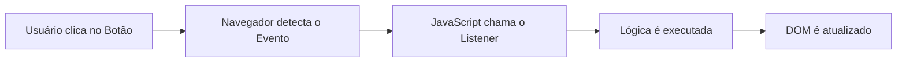

# Aula 09 - Eventos no DOM ⚡

!!! tip "Objetivo"
    **Objetivo**: Aprender a capturar as interações do usuário (cliques, digitação, envios de formulário) e reagir a elas utilizando ouvintes de eventos (`Event Listeners`).

---

## 1. O que são Eventos? 🔔

Eventos são ações que acontecem na sua página, como um clique de botão, o carregamento de uma imagem ou a digitação em um campo de formulário. O JavaScript pode "ouvir" esses eventos e executar uma função quando eles ocorrem.

---

## 2. O Método `addEventListener` 👂

Esta é a forma moderna e recomendada de lidar com eventos. Ela permite adicionar vários ouvintes ao mesmo elemento sem sobrescrever os anteriores.

```javascript
const botao = document.querySelector('#meu-botao');

// Sintaxe: elemento.addEventListener('evento', funcao)
botao.addEventListener('click', () => {
  alert("O botão foi clicado! 🎉");
});
```

---

## 3. Eventos Mais Comuns 🛠️

| Evento | Quando ocorre? | Uso comum |
| :--- | :--- | :--- |
| **`click`** | Ao clicar em um elemento. | Botões, links, menus. |
| **`submit`** | Ao enviar um formulário. | Validação antes do envio. |
| **`input`** | Ao digitar em um campo. | Busca em tempo real. |
| **`mouseover`** | Ao passar o mouse por cima. | Efeitos visuais (hover). |

---

## 4. O Objeto de Evento (`e`) 🗳️

Toda função de evento recebe automaticamente um objeto que contém detalhes sobre o que aconteceu.

```javascript
const formulario = document.querySelector('form');

formulario.addEventListener('submit', (event) => {
    // Impede a página de recarregar (comportamento padrão)
    event.preventDefault(); 
    
    console.log("Formulário enviado com sucesso!");
});
```

---

## 5. Fluxo de Interatividade 📊



---

## 6. Prática no Terminal (Simulação) 💻

```termynal
$ // Simulando a captura de um clique
$ const btn = { addEventListener: (ev, cb) => console.log("Ouvindo " + ev) };
$ btn.addEventListener('click', () => {});
> "Ouvindo click"
$ // Exemplo de preventDefault
$ const ev = { preventDefault: () => console.log("Recarregamento impedido!") };
$ ev.preventDefault();
> "Recarregamento impedido!"
```

> [!TIP]
> Use sempre `event.preventDefault()` em formulários se você pretende processar os dados via JavaScript sem atualizar a página (comum em SPAs).

---

## 7. Mini Projeto: Contador de Cliques 🏆

Crie um pequeno contador interativo.
1.  No HTML, coloque um botão e um parágrafo que exibe "Cliques: 0".
2.  No JavaScript, crie uma variável `contador = 0`.
3.  Adicione um evento de `click` ao botão.
4.  Cada vez que o botão for clicado, aumente o contador e atualize o texto do parágrafo no DOM.

---

## 8. Exercícios de Fixação 📝

### Básicos
1. Qual a vantagem de usar `addEventListener` em vez do atributo `onclick` no HTML?
2. Para que serve o método `event.preventDefault()`?

### Intermediários
3. Como você capturaria o que o usuário está digitando em um campo de texto em tempo real? Qual evento usaria?
4. Escreva o código para mudar a cor de fundo de um `<div>` para amarelo quando o mouse passar por cima dele (`mouseover`).

### Desafio
5. **Validador de Formulário**:
   Crie um formulário com um campo de e-mail e um botão de envio.
   - Ao enviar o formulário, impeça que a página recarregue.
   - Verifique se o campo de e-mail está vazio.
   - Se estiver vazio, exiba uma mensagem de erro vermelha no DOM abaixo do campo.

---

**Próxima Aula**: Vamos aprender a mudar o visual da página dinamicamente com [Estilos e Classes no DOM](./aula-10.md)! 🎨
