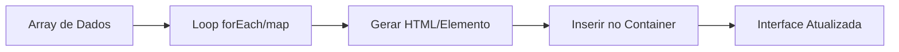

# Aula 11 - Templates e Listas Dinâmicas 📜

!!! tip "Objetivo"
    **Objetivo**: Aprender a gerar conteúdo HTML dinamicamente a partir de dados em JavaScript, utilizando Template Strings e métodos de criação de elementos para construir interfaces flexíveis.

---

## 1. Do Dado para a Tela 🔄

Na web moderna, raramente escrevemos todos os itens de uma lista manualmente no HTML. Geralmente, recebemos uma lista de objetos do JavaScript (ou de uma API) e precisamos transformá-los em elementos visuais.

---

## 2. Template Strings (Caminho Rápido) ⚡

A forma mais simples de gerar HTML é usando as crases (backticks `` ` ``). Elas preservam quebras de linha e permitem injetar variáveis com `${}`.

```javascript
const produto = { nome: "Mouse", preco: 50 };

const html = `
  <div class="card">
    <h2>${produto.nome}</h2>
    <p>Preço: R$ ${produto.preco}</p>
  </div>
`;

document.body.innerHTML += html;
```

---

## 3. Criando Elementos (`createElement`) 🏗️

Neste método, criamos o elemento "no ar", configuramos suas propriedades e o "penduramos" no DOM usando o `appendChild`. É mais seguro e performático para listas grandes.

```javascript
const lista = document.querySelector('#minha-lista');
const novoItem = document.createElement('li');

novoItem.textContent = "Novo Item Dinâmico";
novoItem.classList.add('item-estilizado');

lista.appendChild(novoItem);
```

---

## 4. Gerando Listas com `forEach` 📊



---

## 5. Prática no Terminal (Simulação) 💻

```termynal
$ const nomes = ["Ana", "Beto", "Caio"];
$ // Gerando uma string de lista
$ const html = nomes.map(n => `<li>${n}</li>`).join("");
$ console.log(html);
> "<li>Ana</li><li>Beto</li><li>Caio</li>"
$ // Inserindo no DOM (simulado)
$ document.body.innerHTML = html;
```

> [!CAUTION]
> Ao usar `.innerHTML` para gerar listas, lembre-se que ele apaga o conteúdo anterior se você usar `=` em vez de `+=`. Além disso, tenha cuidado com ataques de injeção (XSS).

---

## 6. Mini Projeto: Vitrine de Produtos 🏆

Imagine que você recebeu esta lista: `const produtos = [{n: 'Celular', p: 2000}, {n: 'Fone', p: 100}]`.
1.  Crie um container `<div id="vitrine"></div>` no seu HTML.
2.  No JavaScript, percorra a lista de produtos.
3.  Para cada produto, crie um "card" (pode ser uma `div`) contendo o nome e o preço formatado.
4.  Insira todos os cards dentro da `#vitrine`.

---

## 7. Exercícios de Fixação 📝

### Básicos
1. Qual a diferença entre aspas simples (`' '`) e crases (`` ` ` ``) ao trabalhar com strings?
2. Para que serve o método `appendChild`?

### Intermediários
3. Como você converteria um array de strings `['item1', 'item2']` em um array de elementos `<li>` usando o método `.map()`?
4. Qual o perigo de usar `.innerHTML` para inserir dados que o próprio usuário digitou?

### Desafio
5. **Filtro de Lista**:
   - Crie um array de objetos `pessoas` com `nome` e `idade`.
   - Gere a lista no DOM mostrando apenas as pessoas que são maiores de 18 anos.
   - **Extra**: Adicione um botão "Mostrar Todos" que limpa a lista e gera novamente com todo mundo.

---

**Próxima Aula**: Vamos conectar nossa página ao mundo real com [Requisições e Consumo de APIs](./aula-12.md)! 🌐
