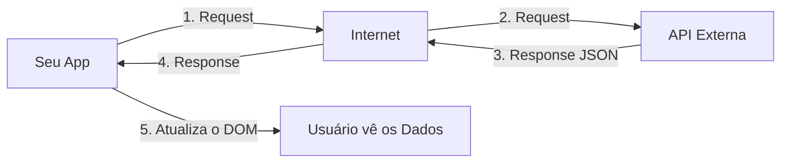

# Aula 12 - Requisições e Consumo de APIs 🌐

!!! tip "Objetivo"
    **Objetivo**: Aprender a conectar sua aplicação web a servidores externos, utilizando a Fetch API e o padrão `async/await` para buscar e enviar dados de forma assíncrona.

---

## 1. O que é uma API? 🔌

Uma API (**Application Programming Interface**) funciona como um garçom: você faz um "pedido" (request), ela leva ao "cozinheiro" (servidor) e traz a "comida" (dados) de volta para você. Geralmente, esses dados vêm no formato **JSON**.

---

## 2. Sincronismo vs Assincronismo ⏳

O JavaScript é **Single Thread** (faz uma coisa de cada vez). 
- **Síncrono**: O código espera uma tarefa pesada terminar para continuar. A página trava.
- **Assíncrono**: O código inicia a tarefa (como buscar um dado na internet) e continua rodando outras coisas. Quando o dado chega, ele executa uma função de retorno.

---

## 3. Buscando Dados com `fetch()` 📥

O `fetch` é o método nativo do navegador para fazer requisições HTTP.

```javascript
// Usando async/await (Forma Moderna)
async function buscarDados() {
  try {
    const resposta = await fetch('https://api.exemplo.com/dados');
    const dados = await resposta.json();
    console.log(dados);
  } catch (erro) {
    console.error("Erro ao buscar dados:", erro);
  }
}

buscarDados();
```

---

## 4. Fluxo da Requisição 📊



---

## 5. Prática no Terminal (Simulação) 💻

```termynal
$ // Simulando uma chamada de API
$ fetch('https://api.github.com/users/google')
$   .then(res => res.json())
$   .then(user => console.log(user.name));
> "Google"
```

> [!IMPORTANT]
> Lembre-se que o `fetch` retorna uma **Promise**. Por isso, precisamos usar o `await` ou o `.then()` para esperar que ela seja resolvida.

---

## 6. Mini-Projeto: Consultor de Clima 🌤️

Vamos simular a busca de dados de clima.
1.  Crie um botão "Ver Clima".
2.  Quando clicado, faça um fetch para uma API de testes (como a JSONPlaceholder) ou apenas simule com um `setTimeout`.
3.  Exiba uma mensagem "Carregando..." no DOM enquanto a resposta não chega.
4.  Quando os dados chegarem, exiba a temperatura na tela.

---

## 7. Exercício de Fixação 📝

### Básicos
1. Qual a função do método `.json()` após um `fetch`?
2. O que acontece se você tentar acessar um dado de uma API que caiu sem usar o `try/catch`?

### Intermediários
3. Qual a diferença entre os métodos `GET` e `POST` em uma requisição?
4. Explique por que o uso de `async/await` deixa o código mais fácil de ler do que o uso de vários `.then()`.

### Desafio
5. **Buscador de Usuários do GitHub**:
   - Crie um input onde o usuário digita um nome de perfil do GitHub.
   - Ao clicar em um botão, faça um `fetch` para `https://api.github.com/users/NOME_DIGITADO`.
   - Exiba a foto (`avatar_url`) e o nome do usuário no DOM.
   - **Extra**: Se o usuário não existir (Erro 404), exiba a mensagem: "Usuário não encontrado!".

---

**Próxima Aula**: Vamos organizar nosso código com [Tratamento de Erros e Estados de Carregamento](./aula-13.md)! 🛡️
