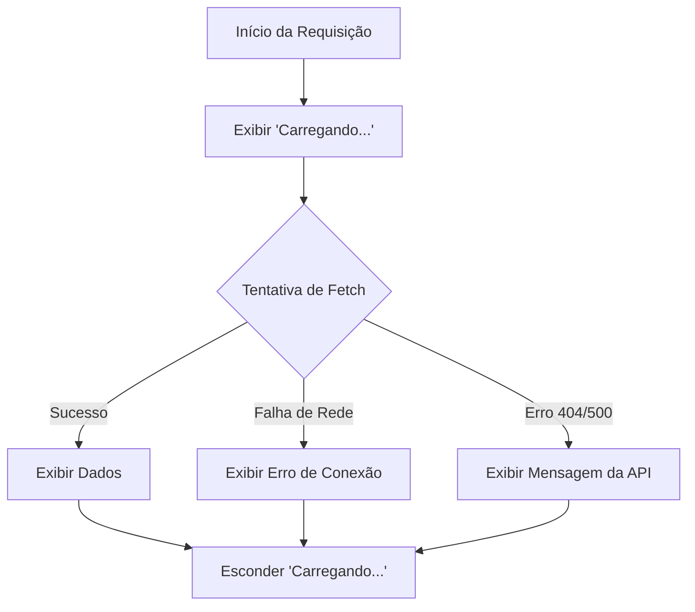

# Aula 13 - Tratamento de Erros e Async 🛡️

!!! tip "Objetivo"
    **Objetivo**: Aprender a lidar com falhas em operações assíncronas de forma elegante, garantindo que sua aplicação não trave e que o usuário seja informado sobre o que aconteceu.

---

## 1. O que pode dar errado? 💣

Ao trabalhar com APIs e rede, muitas coisas fogem do nosso controle:
- A internet do usuário cai.
- O servidor da API fica fora do ar (Erro 500).
- O dado que você pediu não existe (Erro 404).
- O usuário não tem permissão (Erro 401/403).

---

## 2. Blocos `try...catch` 🏗️

Esta é a estrutura fundamental para capturar erros. O código dentro do `try` é executado; se algo falhar, o controle pula imediatamente para o `catch`.

```javascript
async function carregarPerfil() {
  try {
    const resposta = await fetch('https://api.github.com/users/usuario_inexistente');
    
    // IMPORTANTE: fetch só joga para o catch em erro de CONEXÃO. 
    // Erros 404/500 precisam ser checados manualmente:
    if (!resposta.ok) {
        throw new Error("Usuário não encontrado!");
    }

    const dados = await resposta.json();
    console.log(dados);
  } catch (erro) {
    console.error("Algo deu errado: " + erro.message);
  } finally {
    console.log("Processo finalizado."); // Roda sempre, independente de erro.
  }
}
```

---

## 3. Estados de Carregamento (Loading) ⏳

Uma boa interface sempre avisa ao usuário o que está acontecendo. Nunca deixe a tela vazia sem explicação.

```javascript
const statusMsg = document.querySelector('#status');

async function buscarGitHub() {
    statusMsg.textContent = "Carregando dados..."; // Ativa Loading
    
    try {
        const res = await fetch('...');
        // Processa dados...
        statusMsg.textContent = "Dados carregados!";
    } catch (e) {
        statusMsg.textContent = "Erro ao carregar. Tente novamente.";
    }
}
```

---

## 4. Ciclo de Vida do Erro 📊



---

## 5. Prática no Terminal (Debugging) 💻

```termynal
$ // Simulando um erro de promessa rejeitada
$ const p = Promise.reject("Servidor Ocupado");
$ p.catch(err => console.log("Atenção: " + err));
> "Atenção: Servidor Ocupado"
$ // Usando debugger para pausar na hora do erro
$ debugger;
> "Execução pausada no console"
```

> [!IMPORTANT]
> A propriedade `response.ok` é `true` se o status HTTP estiver entre 200 e 299. Fora dessa faixa, você deve tratar como erro.

---

## 6. Mini Projeto: Interface Resiliente 🏆

Crie um buscador de CEP.
1.  Tenha um campo para o CEP e um botão.
2.  Ao clicar, exiba "Buscando endereço..." abaixo do botão.
3.  Faça o fetch para a API do ViaCEP.
4.  Se o CEP for inválido ou a API falhar, exiba o erro em vermelho.
5.  Se funcionar, exiba a rua e o bairro.

---

## 7. Exercícios de Fixação 📝

### Básicos
1. Qual a diferença entre os blocos `try`, `catch` e `finally`?
2. Por que o `fetch` não cai no `catch` quando recebe um erro 404?

### Intermediários
3. Como você lançaria um erro manual usando o comando `throw`?
4. Explique a importância de mostrar um spinner ou mensagem de "Carregando" para o usuário.

### Desafio
5. **Time-out Manual**:
   - Às vezes, uma requisição demora demais.
   - Pesquise ou tente criar uma lógica que cancele a busca se a API demorar mais de 5 segundos para responder.
   - Exiba a mensagem: "O servidor demorou muito para responder. Tente novamente.".

---

**Próxima Aula**: Vamos explorar as [Promessas e Event Loop](./aula-14.md) a fundo! 🕒
