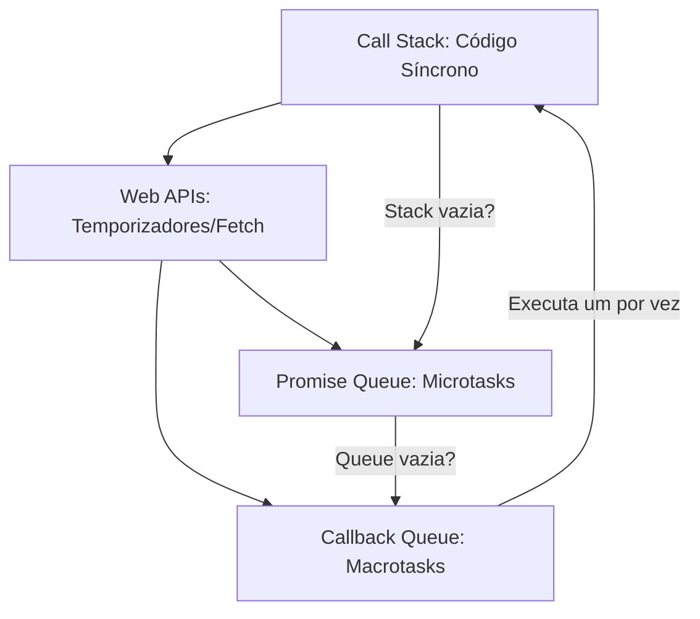

# Aula 14 - Promessas e Event Loop 🕒

!!! tip "Objetivo"
    **Objetivo**: Compreender o funcionamento interno do JavaScript, dominando o ciclo de vida das Promises e como o Event Loop organiza a execução de tarefas assíncronas.

---

## 1. O que é uma Promise? 🤝

Uma **Promise** (Promessa) é um objeto que representa o sucesso ou a falha eventual de uma operação assíncrona.

### Os 3 Estados de uma Promise:
1.  **Pending** (Pendente): Estado inicial, a tarefa ainda não terminou.
2.  **Fulfilled** (Realizada): Sucesso! O dado está disponível.
3.  **Rejected** (Rejeitada): Falha! Algo deu errado.

---

## 2. Criando sua própria Promise 🏗️

```javascript
const minhaPromessa = new Promise((resolve, reject) => {
  const sucesso = true;
  
  setTimeout(() => {
    if (sucesso) {
      resolve("Dados carregados com sucesso! ✅");
    } else {
      reject("Erro ao carregar dados. ❌");
    }
  }, 2000);
});

minhaPromessa
  .then(res => console.log(res))
  .catch(err => console.error(err));
```

---

## 3. O Event Loop 🎡

O JavaScript executa o código em uma única linha (Call Stack). Para não travar, ele usa o **Event Loop**, que gerencia quando as tarefas assíncronas devem voltar para a linha principal.

### Ordem de Prioridade:
1.  **Síncrono**: Roda imediatamente.
2.  **Microtasks** (`Promises`): Rodam logo após o código síncrono.
3.  **Macrotasks** (`setTimeout`): Rodam por último.

---

## 4. O Ciclo de Execução 📊



---

## 5. Prática no Terminal (Desafio de Ordem) 💻

```termynal
$ console.log("1. Início");
$ setTimeout(() => console.log("2. Timeout"), 0);
$ Promise.resolve().then(() => console.log("3. Promessa"));
$ console.log("4. Fim");
> "1. Início"
> "4. Fim"
> "3. Promessa"
> "2. Timeout"
```

> [!CAUTION]
> Evite o "Callback Hell" (várias funções uma dentro da outra). Use `async/await` ou encadeamento de `.then()` para manter o código limpo.

---

## 6. Mini Projeto: Corrida de Promessas 🏆

Use o método `Promise.all` para simular o carregamento de várias fontes de dados ao mesmo tempo.
1.  Crie 3 funções que retornam Promises com tempos diferentes (ex: 1s, 2s e 3s).
2.  Use `Promise.all([p1, p2, p3])` para esperar que todas terminem.
3.  Exiba uma mensagem única quando todos os dados estiverem prontos.

---

## 7. Exercícios de Fixação 📝

### Básicos
1. Quais são os três estados possíveis de uma Promise?
2. Explique a diferença entre `resolve` e `reject`.

### Intermediários
3. Por que uma Promise (Microtask) executa antes de um `setTimeout(..., 0)` (Macrotask)?
4. O que acontece com o código se uma Promise for rejeitada e não houver um `.catch()`?

### Desafio
5. **Simulador de Banco de Dados**:
   - Crie uma função `buscarUsuario(id)` que retorne uma Promise.
   - Se o ID for `1`, resolva com o objeto `{ nome: "Ricardo" }` após 2 segundos.
   - Se o ID for qualquer outro, rejeite com "Usuário não encontrado".
   - Teste a função usando `async/await` e trate o erro.

---

**Próxima Aula**: Vamos explorar as [Novidades do ES6+](./aula-15.md)! 🚀
