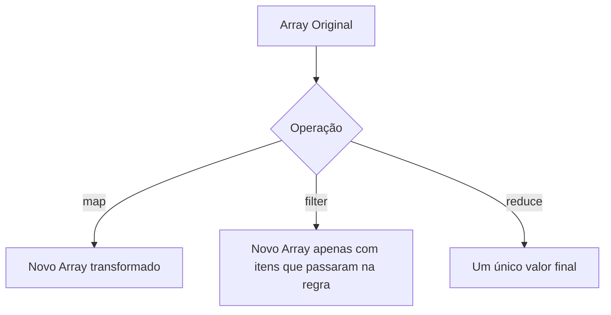

# Aula 15 - Novidades do ES6+ 🚀

!!! tip "Objetivo"
    **Objetivo**: Dominar as funcionalidades modernas do JavaScript (ES6+), como desestruturação, operadores spread/rest e métodos avançados de array, tornando seu código mais limpo e profissional.

---

## 1. O que é o ES6+? 🆕

ES6 (ou ECMAScript 2015) foi a maior atualização da história do JavaScript. Desde então, novas funcionalidades são adicionadas todos os anos (representadas pelo "+").

---

## 2. Desestruturação (Destructuring) 📦

Permite extrair valores de objetos ou arrays de forma rápida e elegante.

```javascript
const usuario = { nome: "Ricardo", idade: 30, cidade: "São Paulo" };

// Sem desestruturação
const n = usuario.nome;

// Com desestruturação
const { nome, idade } = usuario;
console.log(nome); // "Ricardo"

// Arrays também!
const cores = ["Azul", "Verde", "Amarelo"];
const [primeira, segunda] = cores;
```

---

## 3. Operadores Spread e Rest (`...`) 🖌️

- **Spread (Espalhar)**: Transforma um array ou objeto em itens individuais. Ótimo para cópias.
- **Rest (Resto)**: Coleta vários itens em um único array.

```javascript
// Spread
const numeros = [1, 2, 3];
const novosNumeros = [...numeros, 4, 5, 6]; // [1, 2, 3, 4, 5, 6]

// Rest (em funções)
function somarTudo(...args) {
  return args.reduce((acc, curr) => acc + curr, 0);
}
```

---

## 4. Métodos de Array de "Elite" 📊



---

## 5. Prática no Terminal (Simulação) 💻

```termynal
$ const precos = [10, 20, 30, 40];
$ // Filtrando preços maiores que 25 e dobrando o valor
$ const resultado = precos.filter(p => p > 25).map(p => p * 2);
$ console.log(resultado);
> [60]
```

> [!TIP]
> Use o `Spread` para criar cópias de objetos sem alterar o original. Isso é fundamental em bibliotecas modernas como o React (Conceito de Imutabilidade).

---

## 6. Mini Projeto: Manipulador de Lista de Alunos 🏆

1.  Crie um array `alunos` com objetos contendo `nome` e `nota`.
2.  Use o `.filter()` para criar uma lista apenas com os alunos aprovados (nota >= 7).
3.  Use o `.map()` para criar uma lista de strings formatadas: `"O aluno [Nome] foi aprovado!"`.
4.  Exiba essa lista final no DOM.

---

## 7. Exercícios de Fixação 📝

### Básicos
1. Qual a diferença entre o operador `Spread` e o operador `Rest`?
2. Como você extrairia apenas a propriedade `email` de um objeto `cliente` usando desestruturação?

### Intermediários
3. Explique por que o método `.map()` é mais utilizado que o `forEach` quando queremos transformar dados.
4. Dada a variável `const [a, ...b] = [10, 20, 30, 40]`, quais são os valores de `a` e `b`?

### Desafio
5. **O Poder do Reduce**:
   - Imagine um carrinho de compras: `const carrinho = [{n: 'Camiseta', p: 50}, {n: 'Calça', p: 120}]`.
   - Use o método `.reduce()` para calcular o valor total do carrinho em uma única linha de código.
   - Exiba o total formatado como moeda brasileira (R$) no console.

---

**Próxima Aula**: O grande final! [Projeto Prático: Dashboard Interativo](./aula-16.md) 🎮
