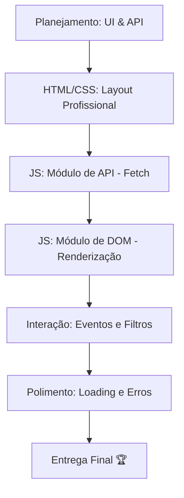

# Aula 16 - Projeto Final: Dashboard Interativo 🏆

!!! tip "Objetivo"
    **Objetivo**: Aplicar TODO o conhecimento técnico adquirido ao longo do curso (Lógica, DOM, Eventos, Requisições e ES6+) para construir uma aplicação real, funcional e com design profissional.

---

## 1. O Desafio Final: "TecPro Dashboard" 🔗

Você deve criar um painel interativo que consome dados reais e permite a interação do usuário. Escolha UM dos temas abaixo:

1.  **Buscador de Repositórios GitHub**: O usuário digita um nome, vê a lista de repositórios, pode filtrar por linguagem e ver detalhes de cada um.
2.  **Monitor de Criptomoedas/Clima**: Exibe preços ou temperaturas em tempo real, permite adicionar "favoritos" em uma lista e atualiza os dados automaticamente.
3.  **Gerenciador de Inventário**: Uma lista de produtos (simulada ou via API) onde é possível adicionar, remover e pesquisar itens dinamicamente.

---

## 2. Requisitos Técnicos Obrigatórios 📋

Seu projeto deve conter obrigatoriamente:
- [ ] **Requisições (Fetch)**: Buscar dados de uma API externa (GitHub, PokeAPI, ViaCEP, etc).
- [ ] **Manipulação de DOM**: Criar elementos dinamicamente (cards, listas, alertas).
- [ ] **Eventos**: Pelo menos 2 tipos de eventos (clique, input, submit).
- [ ] **ES6+**: Uso de Desestruturação, Arrow Functions e Template Strings.
- [ ] **Tratamento de Erros**: Mensagens amigáveis para o usuário em caso de falha na API.
- [ ] **Modularização**: Dividir o código em pelo menos 2 arquivos JS (`api.js` e `main.js`).

---

## 3. Fluxo de Desenvolvimento 📊



---

## 4. Dicas para um Portfólio de Sucesso ✨

Para que seu projeto chame a atenção de recrutadores:
1.  **README.md**: Explique o que o projeto faz e como instalá-lo.
2.  **Design**: Capriche nas cores e no alinhamento! Um site bonito passa muito mais confiança.
3.  **Loading States**: Nunca deixe o usuário no vácuo. Use "Carregando..." ou spinners.
4.  **Limpeza**: Remova `console.log` desnecessários antes da entrega de produção.

---

## 5. Prática Final no Terminal (Simulação) 💻

```termynal
$ // Consolidando tudo em um único flow
$ const app = async () => {
$  const data = await api.get('/user/ricardo');
$  ui.render(data);
$  events.listen();
$ };
$ app();
> "🚀 Aplicação iniciada com sucesso!"
```

---

## 6. Mensagem de Conclusão 🌟

Parabéns, Desenvolvedor! Você completou a jornada de **JavaScript Fundamentos e DOM**. Você saiu do "Olá Mundo" e agora é capaz de construir interfaces inteligentes que conversam com o mundo real.

> "A programação não é sobre o que você sabe; é sobre o que você pode descobrir." — Chris Pine

---

**FIM DO CURSO** 🚀🚀🚀
Desejamos muito sucesso na sua carreira tech!
